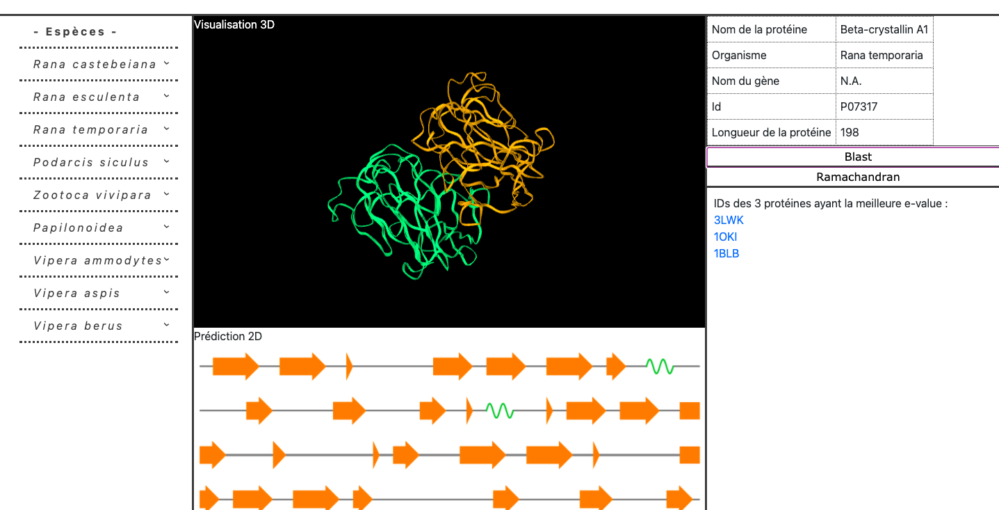

# Protein visualisation and prediction
**Web application to visualise protein prediction and proteins in a 3-dimensional space.** 

  

## Motivation

This project is part of the software engineering course ("GLOG") of the Master of Bioinformatics of the University of Bordeaux. The goal is to provide a web application, dedicated to biologists participating in the ["*Les Sentinelles du Climat*" project](https://www.sentinelles-climat.org/), in order to provide visualization and interaction tools with data extracted from protein information of "*Les Sentinelles du Climat*" species.

## Access
The application is available at : [https://glog-project.herokuapp.com](https://glog-project.herokuapp.com).

## Usage
The user has the possibility to visualize a number of proteins. By clicking on the desired protein, the 3D visualization is displayed in the black frame. The 2D prediction is observable below. Informationw about the protein are presents at the top right. It is also possible to display the 3 proteins ids having their sequence close to the studied protein. Links to the RCSB PDB database for this 3 proteins are available. There is also the possibility of obtaining the Ramachandran diagram of the protein.

## Deployement
The  application is deployed with [Heroku](https://www.heroku.com/).

## Repository import
``` bash
git clone https://github.com/mablt/GLOG-Project.git
```
## Dependencies
The following dependencies are required for execution :
* flask 0.12.2
* requests 2.22.0
* biopython 1.78
* biotite 0.24.0
* matplotlib 3.1.2
* RamachanDraw 0.2.2
* pypdb 2.0

## Authors and contacts
Students of the Bioinformatics Master of the University of Bordeaux.  

> Marine ALVES DE BARROS - [marine.alves-de-barros@etu.u-bordeaux.fr](mailto:marine.alves-de-barros@etu.u-bordeaux.fr)  
> Mathieu BOLTEAU - [mathieu.bolteau1@gmail.com](mailto:mathieu.bolteau1@gmail.com)  
> Mélanie CARRIAT - [melanie.carriat@etu.u-bordeaux.fr](mailto:melanie.carriat@etu.u-bordeaux.fr)  
> Alexandre CORNIER - [alexandre.cornier@etu.u-bordeaux.fr](mailto:alexandre.cornier@etu.u-bordeaux.fr)
> Martin DRANCÉ - [martin.drance@etu.u-bordeaux.fr](mailto:martin.drance@etu.u-bordeaux.fr)
> Rémy JELIN - [remy.jelin@etu.u-bordeaux.fr](mailto:remy.jelin@etu.u-bordeaux.fr)
> Abdelghani NEUHAUS - [abdelghani.neuhauw@etu.u-bordeaux.fr](mailto:abdelghani.neuhauw@etu.u-bordeaux.fr)

